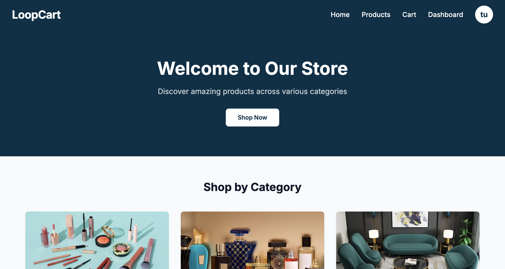

# 🛒 LoopCart - A Next.js E-Commerce Capstone Project

LoopCart is a modern, full-featured e-commerce platform built with Next.js and React. It provides a seamless shopping experience, from Browse products to secure checkout, all wrapped in a clean and responsive user interface. This project serves as a comprehensive capstone project demonstrating modern web development practices.

\<br\>

\<p align="center"\>
\<a href="https://ecommerce-capstone-silk.vercel.app/" target="\_blank"\>
\
\</a\>
\</p\>

\<p align="center"\>
\
\</p\>

-----

## ✨ Core Features

  - **Dynamic Product Catalog:** Browse a rich catalog with advanced search and filtering by category, price, and brand.
  - **Full Shopping Cart:** Add, remove, and update item quantities with a persistent cart that saves across sessions.
  - **Streamlined Checkout:** An intuitive, multi-step checkout process leading to order confirmation.
  - **Secure User Authentication:** A complete authentication system with registration, login, and persistent sessions.
  - **Personalized User Dashboard:** Manage account details, track order status, and view order history.
  - **Responsive Design:** A mobile-first design built with Tailwind CSS ensures a great experience on any device.

-----

## 🚀 Tech Stack

| Category        | Technology                                                              |
| --------------- | ----------------------------------------------------------------------- |
| **Framework** | Next.js 15 (App Router)                                                 |
| **UI Library** | React 19                                                                |
| **Styling** | Tailwind CSS 4, Framer Motion, HeroUI                                   |
| **Backend API** | Next.js API Routes                                                      |
| **Database** | JSON Files (for simplified data persistence)                            |
| **Security** | bcryptjs (for password hashing)                                         |
| **Dev Tools** | Turbopack, ESLint, PostCSS                                              |

-----

## 🛠️ Getting Started

### Prerequisites

  - Node.js v18.x or later
  - npm or yarn

### Installation

1.  **Clone the repository:**

    ```bash
    git clone https://github.com/Crunchymon/EcommerceCapstone
    cd ecommercecapstone
    ```

2.  **Install dependencies:**

    ```bash
    npm install
    ```

3.  **Run the development server:**

    ```bash
    npm run dev
    ```

4.  **Open your browser** and navigate to `http://localhost:3000`.

-----

## 📁 Project Structure

The project uses the Next.js App Router for a clear and scalable structure.

```
ecommercecapstone/
├── app/                  # Core application (pages & layouts)
│   ├── (auth)/           # Route group for auth pages
│   ├── api/              # Backend API endpoints
│   ├── cart/             # Cart page
│   ├── components/       # Reusable React components
│   ├── context/          # Global state management (React Context)
│   ├── dashboard/        # User dashboard pages
│   └── products/         # Product listing and detail pages
├── data/                 # JSON data files (users, products)
├── public/               # Static assets (images, fonts)
└── ...                   # Config files (tailwind.config.js, etc.)
```

-----

## 🚀 Deployment

This application is optimized for deployment on **Vercel**.

1.  Push your code to a GitHub repository.
2.  Connect your repository to your Vercel account.
3.  Vercel will automatically detect it's a Next.js project and deploy it.

-----

## 📝 License

This project is licensed under the MIT License. See the `LICENSE` file for more details.